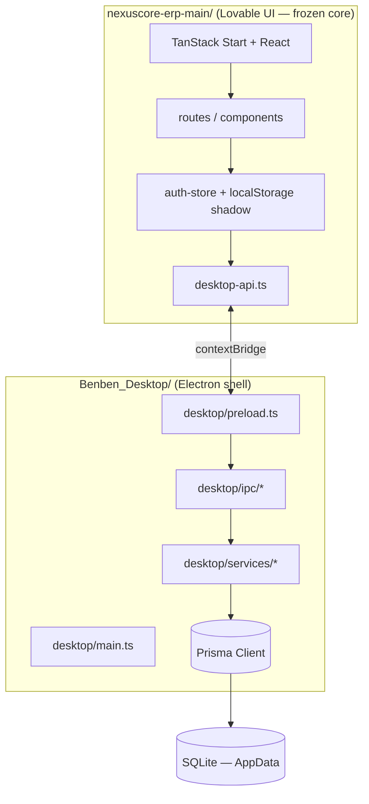

# Benben Desktop — Project State

**Last updated:** 2026-05-20  
**Checkpoint:** Post Phase 2 stabilization (pre–Phase 3)

---

## Architecture



### Design principles

| Principle | Implementation |
|-----------|----------------|
| Local-first | Embedded PostgreSQL at `%APPDATA%\Benben ERP\.benben-db\` |
| UI unchanged | Original app in `nexuscore-erp-main/`; no route/component rewrites |
| Desktop isolation | All OS/DB logic in `desktop/` + `prisma/` |
| Security | `contextIsolation`, no `nodeIntegration`, session token in preload only |
| Future expansion | String IDs, `orgId` on records; IPC service layer ready for LAN/PostgreSQL |

### Runtime layout (Windows)

```
%APPDATA%\Benben ERP\
├── .benben-db\          (embedded PostgreSQL cluster)
├── backups\
├── exports\
├── imports\
├── attachments\
├── logs\benben.log
└── config.json
```

### Dev vs production loading

| Mode | UI source |
|------|-----------|
| Development | External Vite dev server (`BENBEN_UI_URL` or default `http://localhost:8080`) |
| Packaged (later) | Placeholder `desktop/shell/index.html` until production UI bundle is wired |

---

## Installed dependencies

### Root (`npm`) — desktop shell

| Package | Role |
|---------|------|
| `electron` | Desktop runtime |
| `electron-builder` | Windows installer |
| `@prisma/client` + `prisma` | ORM + migrations |
| `bcryptjs` | Password hashing (Phase 2 auth) |
| `typescript`, `cross-env` | Build / scripts |

### `nexuscore-erp-main/` (`bun`) — ERP UI only

TanStack Start, React 19, Radix UI, Tailwind 4, React Query, etc.  
**Not merged** into root `package.json` (intentional isolation).

---

## Build commands

```powershell
cd C:\Users\Tax\Documents\Benben_Desktop

npm install                  # desktop deps + prisma generate (postinstall)
npm run build:desktop        # compile desktop/ → dist-desktop/
npm run build                # same as build:desktop
npm run dist                 # Windows installer (not fully verified)
```

```powershell
# Prisma (CLI dev DB: prisma/dev.db)
npx prisma migrate dev
npx prisma migrate deploy
npx prisma studio
```

---

## Development commands

**Two terminals required:**

```powershell
# Terminal 1 — ERP UI (Bun)
cd C:\Users\Tax\Documents\Benben_Desktop\nexuscore-erp-main
bun install
bun run dev
# Note port in output (usually http://localhost:8080)
```

```powershell
# Terminal 2 — Electron shell (npm)
cd C:\Users\Tax\Documents\Benben_Desktop
npm install
$env:BENBEN_UI_URL="http://localhost:8080"   # if port differs
npm run dev
```

**Verification:**

```powershell
npm run verify:phase1    # AppData, SQLite, IPC scaffold
npm run verify:phase2    # Auth service (bcrypt, sessions)
npm run verify           # both
```

---

## Current status

| Area | Status |
|------|--------|
| Electron shell | Working |
| Prisma + SQLite (AppData) | Working |
| IPC (app, auth, backup scaffold) | Working |
| Auth (desktop) | Working — login, logout, session, initializeAdmin |
| Auth (browser) | Unchanged — localStorage |
| UI in Electron (dev wrapper) | Working when UI dev server running |
| Production UI bundle | Not started |
| Installer (`npm run dist`) | Not verified |
| CRM / inventory / invoicing IPC | Not started |

---

## Completed phases

### Phase 1 — Desktop foundation

- Electron main/preload/shell
- AppData path management
- Prisma schema (minimal: users, settings, audit, sessions)
- SQLite migrations + runtime `migrate deploy`
- IPC scaffolding (app, auth stubs, backup)
- `electron-builder` config
- `npm run verify:phase1`
- Fixes: `ELECTRON_RUN_AS_NODE` for Prisma CLI; default UI port **8080**

### Phase 2 — Auth IPC + adapter

- `desktop/services/auth.service.ts` (bcrypt, sessions, audit logs)
- Auth IPC handlers (login, logout, getSession, initializeAdmin)
- Preload token handling (token never exposed to renderer)
- `nexuscore-erp-main/src/lib/desktop-api.ts` adapter
- Minimal hooks: `login.tsx`, `setup.tsx`, `auth-store` shadow sync
- `npm run verify:phase2`

---

## Remaining roadmap (high level)

1. **Phase 3a** — Session persistence across app restarts (secure token storage)
2. **Phase 3b** — Settings IPC + company profile sync
3. **Phase 4** — Customers / vendors (CRM) IPC + adapter
4. **Phase 5** — Inventory IPC
5. **Phase 6** — Invoicing IPC
6. **Phase 7** — Backup/restore UI wired to desktop services
7. **Phase 8** — Export/import, printing
8. **Phase 9** — Production UI bundle + installer hardening
9. **Later** — LAN multi-user, PostgreSQL, cloud sync (architecture only today)

See `SAFE_NEXT_STEPS.md` for ordered incremental steps.

---

## Verification log (2026-05-20)

| Check | Result |
|-------|--------|
| `npm run build:desktop` | Pass |
| `npx prisma validate` | Pass |
| `npm run verify:phase1` | **15/15** pass |
| `npm run verify:phase2` | **6/6** pass |
| UI HTTP `/` and `/login` | **200** (dev server on :8080) |
| Electron + DB bootstrap | Pass (via verify scripts + logs) |

---

## Known issues / deferred

- Session token lost on app restart (preload memory only)
- `verify:phase2` `initializeAdmin` fails if DB already has users (by design)
- `changePassword`, `register`, `adminCreateUser` still browser localStorage only
- Shadow localStorage can drift if mixing browser + desktop on same machine
- Unpackaged `electron .` always loads dev URL (`!app.isPackaged`)
- `npm run dist` not tested end-to-end
- Electron 36.x npm audit advisories (upgrade deferred)
- Prisma 7.x upgrade available (deferred)
