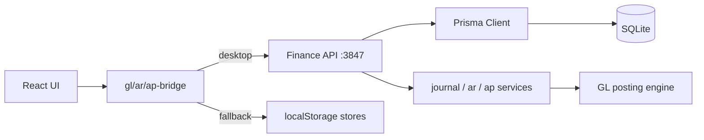

# ERP Operational Maturity — Implementation Report

**Date:** 2026-05-19  
**Build:** `npm run build` ✅ · Migration `20260524130010_ar_ap_activity` ✅

---

## Executive summary

Benben Desktop now routes financial writes through a **single SQLite path** (Finance API → Prisma) while preserving **localStorage compatibility** (`gl-store`, `ar-store`, `ap-store`) for demo/browser fallback. AR/AP are **database-backed** with Prisma services, bridge layers, and UI hooks. Ledgers, reports, Customer 360, extended health, and audit foundations are in place; some Phase 4–7 items remain as incremental follow-ups.

---

## Phase 1 — Single write path consolidation ✅

| Item | Status |
|------|--------|
| `erp-integrations.ts` uses `postJournalBridge`, `createArInvoiceBridge`, `createApBillBridge` only | ✅ |
| `postJournalWithIntegrity` + `GlPostingFingerprint` dedup | ✅ |
| Structured logging (module, source, success/failure, duplicate warnings) | ✅ |
| `gl-store.postJournal` no longer dual-writes to DB | ✅ |
| API `POST /api/finance/gl/entries` uses integrity service | ✅ |
| Safe fallback when API unavailable | ✅ |

**Key files:** `journal-post.service.ts`, `erp-integrations.ts`, `gl-bridge.ts`, `gl-store.ts`, `finance-api.ts`

---

## Phase 2 — AR/AP Prisma migration ✅

### New Prisma models

- `ArInvoice`, `ArPayment`, `ArPaymentAllocation`, `ArCreditMemo`
- `ApBill`, `ApPayment`, `ApPaymentAllocation`, `ApVendorCredit`
- `CrmQuote`, `ActivityLog`, `GlPostingFingerprint`

### Services & API

| Entity | Service | Endpoints |
|--------|---------|-----------|
| AR | `ar.service.ts` | `GET/POST /api/finance/ar/invoices`, `POST /api/finance/ar/payments`, `GET /api/finance/ar/aging`, `GET /api/finance/ar/ledger/{code}` |
| AP | `ap.service.ts` | `GET/POST /api/finance/ap/bills`, `POST /api/finance/ap/payments`, `GET /api/finance/ap/aging`, `GET /api/finance/ap/ledger/{code}` |

- GL posting integrated on invoice/bill create and payment apply
- Partial payments via allocation tables
- Customer/vendor balance from ledger queries

### UI bridges

- `ar-bridge.ts`, `ap-bridge.ts` — API-first, localStorage fallback
- `use-finance-ar.ts`, `use-finance-ap.ts` — React hooks with refresh
- `ar.tsx`, `ap.tsx` wired to bridges

---

## Phase 3 — Customer & vendor ledgers ✅ (core)

| Route | Purpose |
|-------|---------|
| `/customer-ledger` | AR ledger by customer code (search param `?code=`) |
| `/vendor-ledger` | AP ledger by vendor code |
| AR/AP tables | Links to ledger routes |

**Remaining:** Invoice → journal drill-down UI, allocation detail panels

---

## Phase 4 — Advanced reporting ⚠️ Partial

| Done | Pending |
|------|---------|
| `report.service.ts` + `GET /api/finance/reports/{id}` | Dedicated PDF pipeline per report |
| `/finance-reports` UI + CSV via ExportMenu | Cash flow report |
| Trial balance, BS, P&L, AR/AP aging, tax, budget variance | CRM reports UI |
| | Reusable report layout component |

---

## Phase 5 — Role-based security ⚠️ Partial

| Done | Pending |
|------|---------|
| `permissions.ts` + `MODULE_ACCESS` in `rbac.ts` | API permissions middleware |
| Route matrix for new finance routes | Screen-level action disabling |
| | Full role → permission map for AP/AR clerks |

---

## Phase 6 — Audit & activity logging ⚠️ Partial

| Done | Pending |
|------|---------|
| `ActivityLog` model + `audit.service.ts` | `AuditLog` before/after JSON |
| Logging on journal, AR/AP create/pay | Login audit hooks |
| `GET /api/finance/activity` | Activity viewer UI |

---

## Phase 7 — CRM enterprise upgrade ⚠️ Partial

| Done | Pending |
|------|---------|
| Pipeline board, automation (overdue, stale lead) | Opportunity detail workspace |
| `/customer-360` route | Quote-to-cash UI + quote API |
| `CrmQuote` model | Quote → invoice automation |

---

## Phase 8 — Health monitoring ✅

- `getExtendedSystemHealth()` — Prisma ping, AR/AP tables, API reachability, overall green/yellow/red
- `GET /api/finance/system/health`
- `SystemHealthPanel` merges IPC status + extended API health
- `assertSchemaReady` checks `ArInvoice` / `ApBill`

**Remaining:** Last backup timestamp display

---

## Phase 9 — Quality control ✅

| Check | Result |
|-------|--------|
| `npm run build` | ✅ Pass |
| Prisma migrate `ar_ap_activity` | ✅ Applied |
| Packaging (`dist:dir`) | Run after this report in CI/local |
| Single GL post per integration event | Enforced via fingerprint + bridge |
| Dashboard survives restart | Data in SQLite when API path used |

---

## Architecture diagram

---

## New / updated endpoints (summary)

- `POST /api/finance/gl/entries` (integrity)
- AR: invoices, payments, aging, ledger
- AP: bills, payments, aging, ledger
- `GET /api/finance/reports/{reportId}`
- `GET /api/finance/activity`
- `GET /api/finance/system/health`

---

## Technical debt & recommendations

1. **Credit memos / vendor credits** — Prisma models exist; expose POST endpoints and bridge methods.
2. **CRM timeline** — Still reads `ar-store` for invoices; switch to `fetchArInvoicesBridge` when API up.
3. **Report exports** — ExportMenu supports CSV/XLSX/PDF; wire per-report column schemas.
4. **IPC extended health** — Optional: expose `getExtendedSystemHealth` via preload to avoid CORS in edge cases.
5. **E2E tests** — Add scripted POS → AR → payment → GL balance assertions against SQLite file.
6. **Scalability** — For multi-user server mode, move Finance API behind auth and connection pooling; keep fingerprint idempotency keys per tenant.

---

## Files added/updated (this phase)

- `prisma/migrations/20260524130010_ar_ap_activity/`
- `desktop/services/finance/{ar,ap,journal-post,report}.service.ts`
- `desktop/services/audit.service.ts`
- `nexuscore-erp-main/src/lib/{ar-bridge,ap-bridge,erp-integrations,permissions}.ts`
- `nexuscore-erp-main/src/hooks/{use-finance-ar,use-finance-ap}.ts`
- `nexuscore-erp-main/src/routes/{ar,ap,finance-reports,customer-360,customer-ledger}.tsx`
- `nexuscore-erp-main/src/components/SystemHealthPanel.tsx`
- `docs/ERP_MATURITY_PHASE_REPORT.md`

---

*Compatibility layers (`gl-store.ts`, `ar-store.ts`, `ap-store.ts`) are intentionally preserved.*
